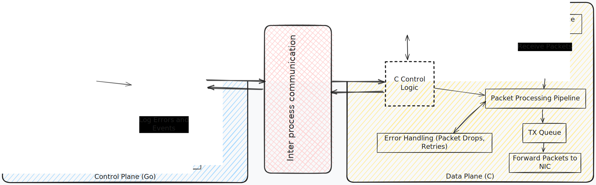

# kiki

kiki is a low-latency, high-throughput Layer 4 load balancer built using the [**DPDK**](https://www.dpdk.org/) kernel bypass technique. It features a C-based data plane for efficient packet processing and a Go-based control plane to manage configurations and non-performance-critical operations.

Below is a rough outline of kiki's planned internal architecture:

## **🚧 Work in Progress** 🚧
This is a learning project focused on exploring low-latency networking and high-performance programming. 